<h2> QuickBlox Flutter VideoChat Sample </h2>

# Overview

This is a code sample for [QuickBlox](http://quickblox.com/) platform.
It is a great way for developers using QuickBlox platform to learn how to integrate audio and video calling features into your application.

# Features

QuickBlox Flutter VideoChat Sample provides next functionality:

- Authenticate with Quickblox
- Receive and display users list
- Make audio calls
- Make video calls

# Video

<table align="center">
  <tr>
    <td align="center">
      <strong>iOS</strong> 
      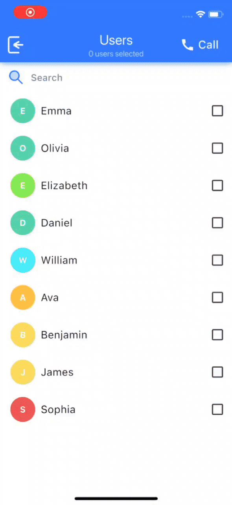
    </td>
    <td style="width: 50px;"></td>
    <td align="center">
      <strong>Android</strong> 
      
    </td>
  </tr>
</table>

# Screenshots

## IOS

  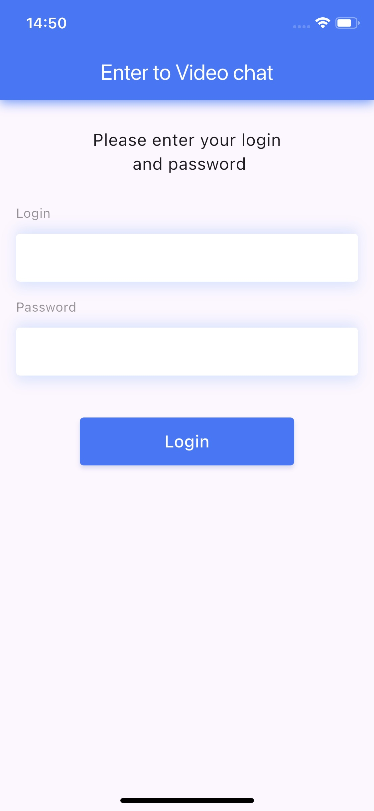
  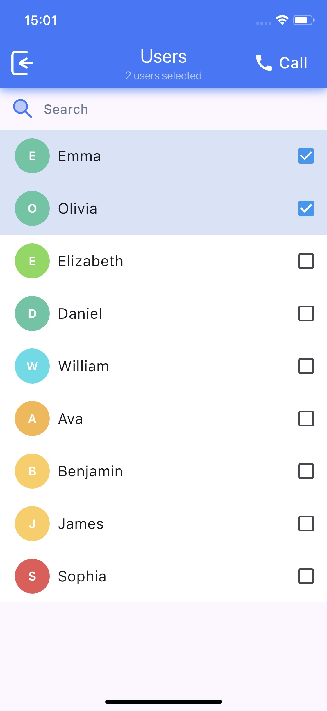
  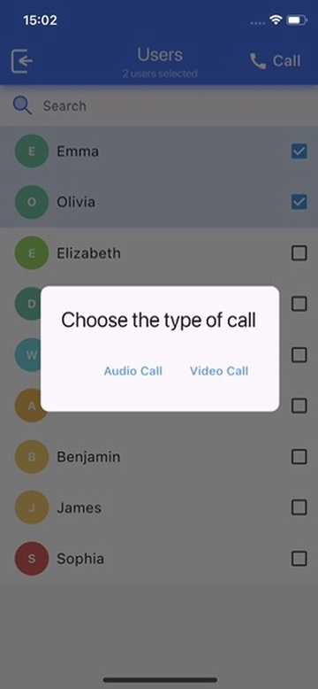
  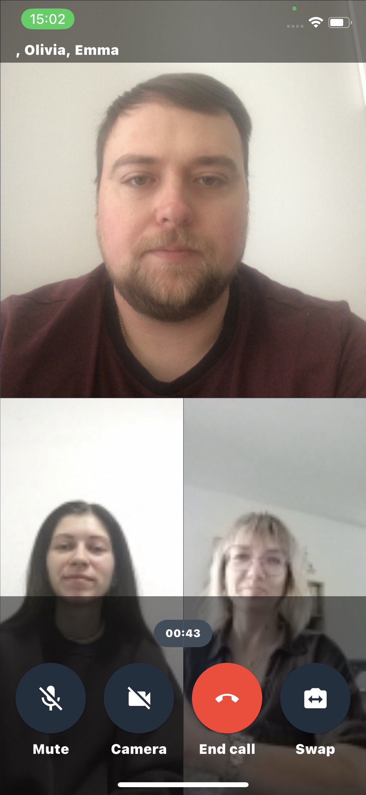
  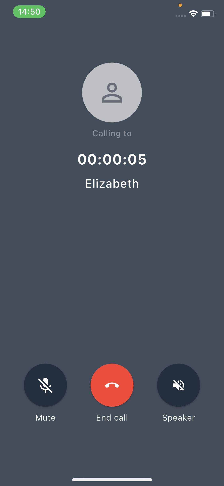

## Android

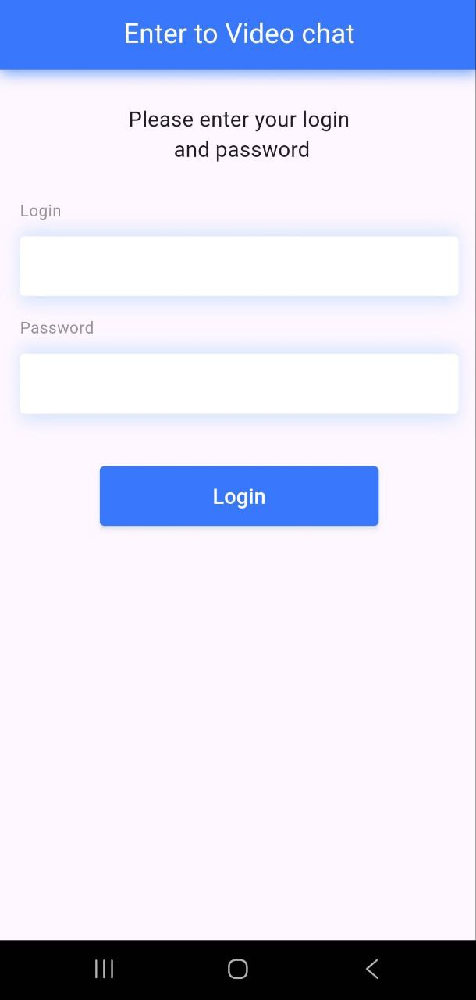
  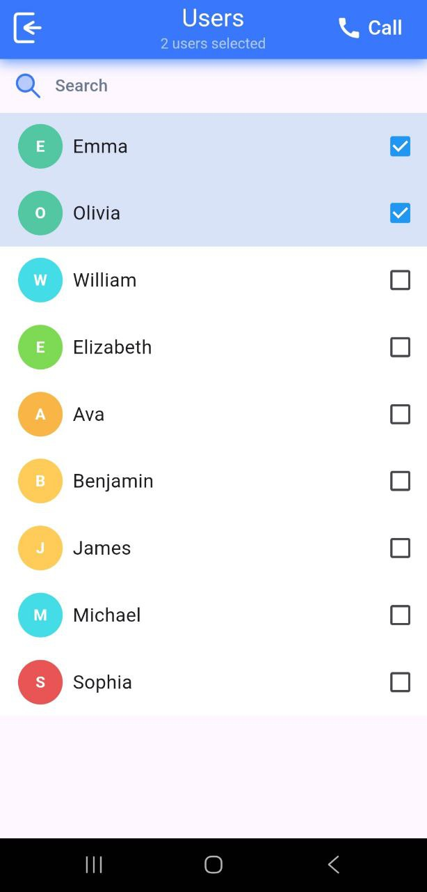
  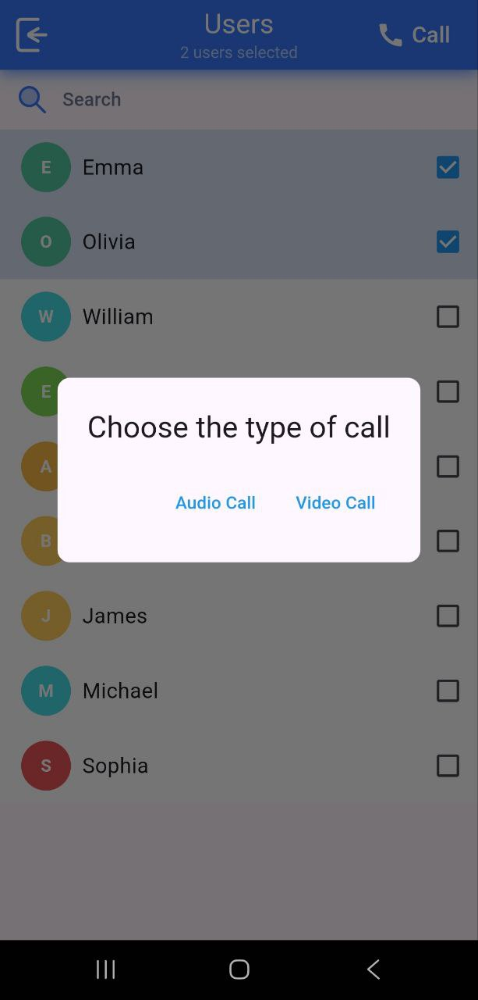
  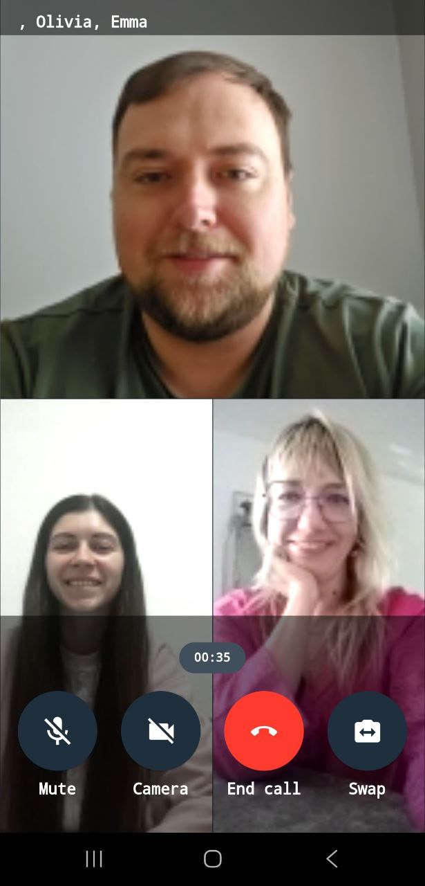
  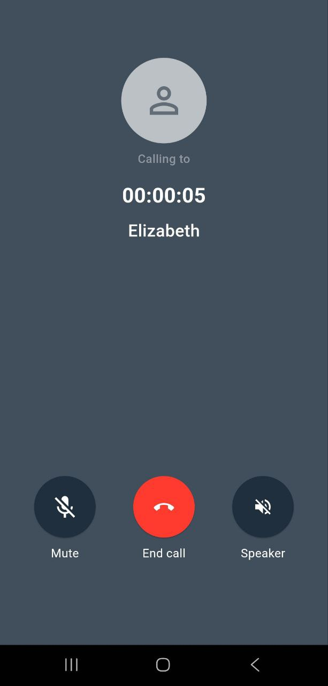

# Get application credentials

QuickBlox application includes everything that brings messaging right into your application - chat, video calling, users, push notifications, etc. To create a     QuickBlox application, follow the steps below:

  1.Register a new account following [this link](https://admin.quickblox.com/signup). Type in your email and password to sign in. You can also sign in with your Google or Github accounts.  
  2.Create the app clicking **New app** button.  
  3.Configure the app. Type in the information about your organization into corresponding fields and click **Add** button.  
  4.Go to **Dashboard => _YOUR_APP_ => Overview** section and copy your **Application ID**, **Authorization Key**, **Authorization Secret**, and **Account Key**.  

# To run the Video Sample

  1. Clone the repository using the link below:  

    git clone https://github.com/QuickBlox/quickblox-flutter-samples.git

  2. Go to menu **File => Open Project**. (Or "Open an existing Project" if (Android Studio/Visual Studio Code) is just opened)  
  3. Select a path to the sample.  
  4. [Get application credentials](#get-application-credentials) and get **Application ID**, **Authorization Key**, **Authorization Secret**, and **Account Key**.  
  5. Open **main.dart** and paste the credentials into the values of constants.  

    const val APPLICATION_ID = ""
    const val AUTH_KEY = ""
    const val AUTH_SECRET = ""
    const val ACCOUNT_KEY = "";  
      
  6. Run the code sample.
